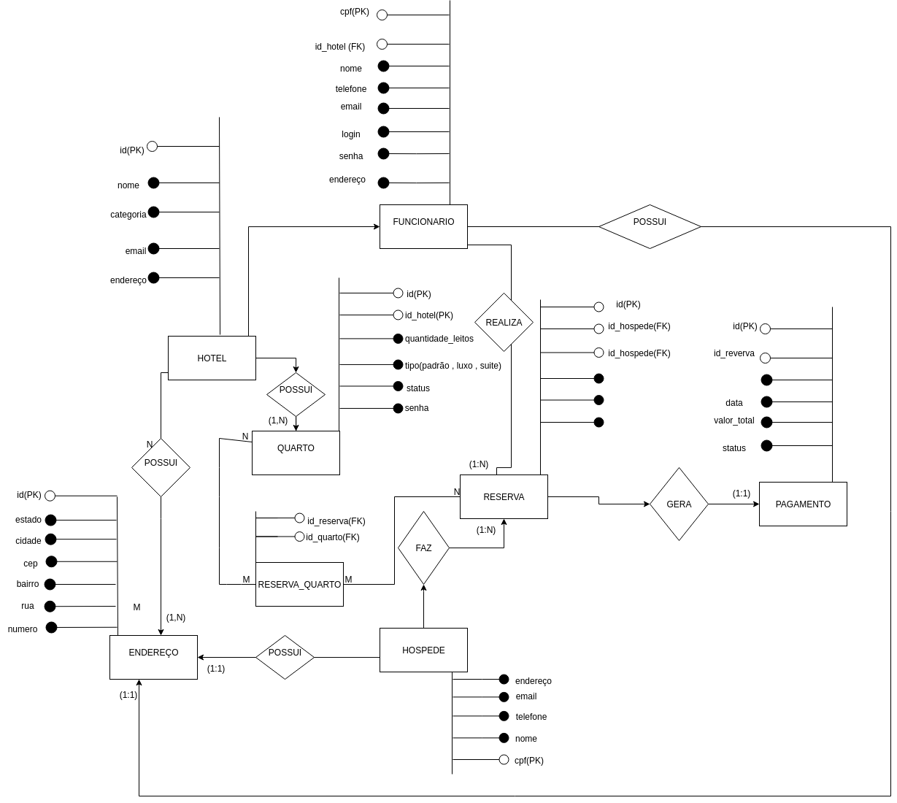

# Projeto-rede-hotel-uniter

Aplicação prática de conhecimentos adquiridos na disciplina de Banco de Dados, com uso de projetos desenvolvidos durante a graduação em contexto profissional real.

## <H3>MER (modelo entidade relacional) </H1> 

